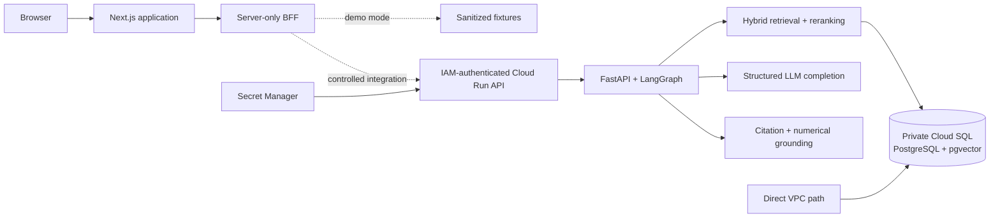

# SETU Intelligence Workspace

SETU is an evidence-first workspace for exploring India’s digital public
infrastructure and selected public-program eligibility rules. It combines a
multilingual retrieval-augmented generation (RAG) backend with a recruiter-ready
Next.js interface that makes the route, confidence, citations, and source context
visible alongside each answer.

This repository is a portfolio case study in building an AI system whose claims
can be inspected. It does not claim production scale, continuous public
availability, or commercial adoption.

## Why SETU

Policy and public-infrastructure information is often distributed across long,
multilingual source documents. A fluent answer alone is not enough: a reader
needs to know which evidence was retrieved, whether citations are real, and
where the system’s confidence should stop.

SETU addresses that problem with:

- hybrid dense and keyword retrieval over a private PostgreSQL/pgvector corpus;
- reranking before answer generation;
- agent routing between document retrieval and structured eligibility lookup;
- multilingual answer controls for English, Hindi, and Bengali;
- citation selection, validation, stable ordering, and de-duplication;
- deterministic checks for digit-form numerical claims;
- a secure Next.js backend-for-frontend (BFF) boundary; and
- explicit abstention and safe error behavior when evidence or configuration is
  insufficient.

## Product experience

The frontend includes four portfolio views:

- **[Workspace](frontend/src/app/workspace/page.tsx)** — a guided intelligence
  surface with a sanitized grounded-answer demonstration and eligibility flow.
- **[Sources](frontend/src/app/sources/page.tsx)** — a bounded evidence explorer
  with search, language, eligibility, pagination, and source-detail states.
- **[System trust](frontend/src/app/system/page.tsx)** — a content-safe view of
  identity, secret, networking, database, and grounding controls.
- **[Case study](frontend/src/app/case-study/page.tsx)** — the engineering journey
  and evidence from one controlled authenticated cloud query.

Demo mode is the default. Its fixtures are sanitized and make no backend,
provider, database, or cloud request.

## Architecture



The browser sends same-site requests to Next.js API routes. Credentials stay in
the server process; they are never exposed as `NEXT_PUBLIC_` configuration. The
current local adapter accepts only an HTTP loopback origin. The future cloud
adapter is deliberately disabled until a deployed frontend identity can obtain
an audience-bound IAM token server-side.

The deployed backend is private-by-authentication: Cloud Run ingress is
internet-reachable but has no public principal, so IAM authentication is
required before the application API-key check. Cloud SQL has a private address
only and is reached through private networking. See
[Architecture](docs/architecture.md) and [Security](docs/security.md).

## Grounded query workflow

1. Validate request size, schema, origin, authentication, and rate limit.
2. Ask the structured router to select `retrieve_docs` or
   `check_eligibility`.
3. For retrieval, combine pgvector similarity and PostgreSQL full-text search
   with reciprocal-rank fusion, then rerank the candidate set.
4. Generate a schema-constrained answer from the selected evidence.
5. Accept only cited chunk identifiers present in the retrieved set; remove
   duplicate identifiers and duplicate evidence.
6. Check digit-form numeric claims against the supporting evidence. A bounded
   correction completion is available when this check fails.
7. Return the answer, selected route, confidence, citations, and request ID—or
   a stable, content-safe error/abstention response.

Eligibility answers use structured database criteria rather than pretending
that table rows are document citations.

## Technology

| Layer | Stack |
|---|---|
| Frontend | Next.js 16, React 19, TypeScript, TanStack Query, Zod, Radix UI |
| BFF | Next.js Route Handlers, same-site checks, bounded payloads, server-only secrets |
| API | Python 3.11, FastAPI, Pydantic, SQLAlchemy async, LangGraph |
| Retrieval | PostgreSQL 16, pgvector, full-text search, BGE-M3, BGE reranker, OpenVINO |
| Providers | Groq primary; Gemini adapter present but not used in the validated cloud query |
| Infrastructure | Docker, Artifact Registry, Cloud Run, Cloud SQL, Secret Manager, Direct VPC networking |
| Quality | unittest/pytest, Vitest, Testing Library, Playwright, ESLint, TypeScript, GitHub Actions |

## Verified evidence baseline

The evidence frozen before publication records:

| Area | Verified result |
|---|---|
| Corpus | 8 documents / 239 chunks / 3 eligibility records |
| Backend regression suite | 98 tests passed |
| Frontend unit/integration suite | 18 default tests passed; 1 opt-in local integration test separately passed |
| Browser suite | 9 Playwright tests passed |
| Frontend production build | Passed with Node.js 22 |
| Frontend dependency audit | 0 known vulnerabilities reported by `npm audit` |
| Cloud backend | 1 service; 1 active-ready revision at 100% traffic; 1 retained historical revision at 0% |
| Cloud health | Authenticated `/health`, `/health/db`, and `/ready` returned 200 |
| Controlled cloud query | HTTP 200; `retrieve_docs`; confidence 0.9; 3 distinct valid citations |
| Query preservation | 1 external submission, no manual retry, no database query-log insertion |

The controlled query took approximately 69 seconds end to end. It is evidence
that the path worked once under a strict request budget, not a latency or
availability benchmark. Evaluation methods and boundaries are documented in
[Evaluation](docs/evaluation.md).

## Local development

### Requirements

- Node.js 22.x for the frontend (the validated runtime was Node.js 22)
- Python 3.11 for the backend
- Docker Desktop with Compose for the local PostgreSQL/API stack

### Safe frontend demo

```bash
cd frontend
npm ci
npm run dev -- --hostname 127.0.0.1 --port 3000
```

Open `http://127.0.0.1:3000/workspace`. No environment file is required: demo
mode is the fail-safe default and uses only sanitized local fixtures. See the
[local demo guide](docs/local-demo.md) for routes and controlled adapter modes.

### Local backend

Copy the example file locally and replace every credential placeholder with a
local-only value. `.env` is ignored and must never be committed.

```bash
cp .env.example .env
docker compose up -d --build db api
curl --fail http://127.0.0.1:8000/health
curl --fail http://127.0.0.1:8000/health/db
curl --fail http://127.0.0.1:8000/ready
```

`/ready` is expected to fail closed until database, API authentication, one LLM
provider, and the selected inference backend are correctly configured. Never
put a provider key, application API key, database password, identity token, or
cloud identifier in a tracked file.

The backend health commands do not execute `/query`. A real query invokes a
provider and should be run only with an explicit request budget.

## Validation commands

Backend checks from the repository root:

```bash
python -m compileall -q app ingestion eval tests
python -m unittest discover -s tests -v
python -m pip check
docker compose config --quiet
```

Frontend checks:

```bash
cd frontend
npm run typecheck
npm run lint
npm run test:run
npm run build
npm run test:e2e
npm audit
```

Playwright expects the safe local frontend to be running. The opt-in local BFF
test is intentionally excluded from the default suite unless its explicit
environment gate is set; it uses a loopback test transport, not the cloud
backend.

## Repository structure

```text
app/                    FastAPI, agent graph, grounding, security, retrieval
db/                     PostgreSQL/pgvector bootstrap schema
docs/                   Architecture, security, evaluation, demo, deployment
eval/                   Small multilingual regression fixtures and metrics
frontend/               Next.js application, BFF, tests, and demo fixtures
ingestion/              PIB fetch, language-aware chunking, embeddings, writes
scripts/                Isolated OpenVINO export helper
tests/                  Backend regression tests
.github/workflows/      CI and supply-chain evidence generation
```

## Security principles

- fail closed when identity, secret, provider, database, or model configuration
  is missing;
- keep browser-safe configuration separate from server-only credentials;
- use IAM plus application authentication, with no public Cloud Run principal;
- give runtime identities only the Cloud SQL and per-secret access they need;
- keep the database private, encrypted, deletion-protected, and free of public
  authorized networks;
- deploy immutable images and preserve failed historical revisions as audit
  evidence;
- return bounded schemas and content-safe diagnostics, never prompts, document
  bodies, credentials, or stack traces; and
- treat citations, numeric validation, and human review as controls—not proof
  that every answer is correct.

## Known limitations

- Production `query_logs` insertion is not implemented. If observability is
  added, structured Cloud Logging is preferred over granting the runtime
  database user write access only to populate that table.
- Exact successful Groq HTTP-attempt telemetry is unavailable, and the
  configured provider HTTP-attempt ceiling is higher than the normal two-step
  logical workflow.
- The deployed numeric guard detects digit expressions; word-form numbers need
  manual review or a future expanded validator.
- The validated query took approximately 69 seconds.
- The deployed OCI image is approximately 3.37 GB and scale-to-zero can produce
  cold starts.
- Backend ingress is internet-reachable but IAM-protected; public principals
  remain absent.
- The current frontend is production-quality locally, but public frontend
  hosting and production session authentication are not complete.
- The alerts-only cloud budget is not a spending cap, and the Cloud SQL trial
  requires timely teardown.
- The evaluation sets are small regression fixtures, not statistically robust
  accuracy claims.

## Screenshots

No screenshots are published in this revision because the controlled in-app
capture runtime was unavailable during the publication audit. The interface is
fully reproducible in sanitized demo mode using the [local demo](docs/local-demo.md)
instructions; no image or production result has been invented as a substitute.

## Further reading

- [Architecture](docs/architecture.md)
- [Security model](docs/security.md)
- [Evaluation and validated evidence](docs/evaluation.md)
- [Local demo guide](docs/local-demo.md)
- [Citation-grounding design](docs/CITATION_GROUNDING.md)
- [Deployment runbook](docs/DEPLOYMENT.md)
- [Build roadmap](docs/ROADMAP.md)

## Roadmap

The next engineering step is a separately authorized frontend deployment with
a dedicated service identity, server-side audience-bound IAM tokens, and
production session authentication. Later work should improve structured query
observability, provider-attempt telemetry, word-form numerical checks, image
size, cold-start latency, and the depth of multilingual evaluation. None of
those changes are implemented by this publication commit.

## Data and licensing

The ingestion code targets public PIB release pages, but this repository does
not publish the live database, backups, embeddings, or full source-document
bodies. The tracked evaluation fixtures contain short authored queries, labels,
expected facts, and chunk identifiers for regression testing.

No `LICENSE` file is included. Public visibility makes the work reviewable; it
does not grant an open-source reuse license.

## Author

Built and documented by **Rajdeep Mahanty**.
