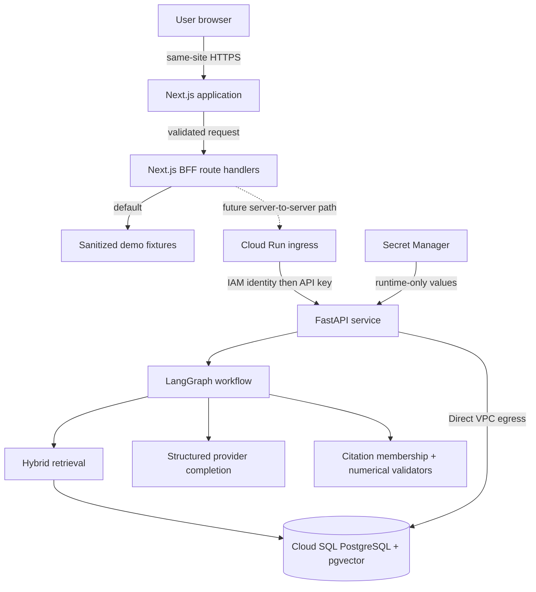
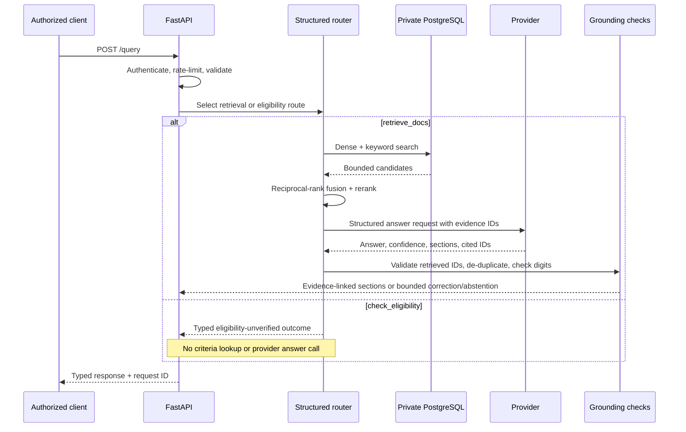

# Architecture

SETU separates the browser experience, credential-bearing server boundary,
grounded reasoning pipeline, and private data plane. The repository contains
both the deployed backend implementation and a local-first frontend whose cloud
adapter remains intentionally disabled.

## System context

The solid path through sanitized fixtures is the current default frontend
experience. The dashed BFF-to-cloud path describes the reviewed target design,
not an active public frontend integration. `SETU_DATA_MODE=cloud` fails closed
until a frontend service identity and production session boundary are deployed.

## Browser and BFF boundary

The browser has no backend URL, application API key, cloud identity token,
database credential, or provider credential. It calls same-origin Next.js Route
Handlers under `/api`.

The BFF:

- validates request schemas with Zod;
- rejects cross-site query submissions;
- caps query requests at 8 KiB;
- limits accepted upstream responses to 1 MiB;
- disables redirects and caching for upstream calls;
- maps upstream failures into stable content-safe errors;
- performs at most one upstream attempt; and
- keeps the application API key in server-only process configuration.

In `demo` mode, the BFF returns sanitized fixtures. In `local` mode, it accepts
only an `http://` loopback origin with no credentials, path, query, or fragment
in the configured URL. In `cloud` mode, it returns a deliberate
`CLOUD_ADAPTER_DISABLED` error.

## Backend request path

Dense retrieval uses BGE-M3 embeddings in pgvector. Keyword retrieval uses
PostgreSQL full-text search. Reciprocal-rank fusion combines both lists before
a BGE reranker selects the evidence supplied to generation. The deployed image
uses exported OpenVINO models for local retrieval inference.

## Data model

The bootstrap schema defines:

- `documents` for bounded source metadata and cleaned source text;
- `chunks` for language-tagged evidence, embeddings, and full-text vectors;
- `eligibility_criteria` for structured program rules;
- `query_logs`, `feedback`, and `eval_runs` as future observability/evaluation
  surfaces.

The deployed runtime database identity is read-only. The application currently
does not insert production `query_logs` rows. This is a known observability gap,
not a reason to expand runtime database privileges.

## Evidence and eligibility integrity boundary

Answer sections carry zero or more citation IDs. The API validates that every
claim-specific ID belongs to the retrieved result set, then applies stable
ordering and exact-evidence de-duplication. The browser renders only that typed
mapping. Membership does not establish semantic entailment; independent human
or semantic review is required before calling a claim supported.

The tracked eligibility rows are illustrative and unverified. Personal
eligibility requests now return a sanitized `eligibility_unverified` result
without reading the criteria table or executing answer generation. The frontend
keeps its multi-step interaction as a non-decision preview and never submits its
profile. Reviewed, versioned rules, effective dates, and official-source
provenance are prerequisites for a future decision engine.

## Cloud deployment

The frozen backend architecture has:

- one IAM-protected Cloud Run service;
- one healthy active revision receiving all traffic and one retained historical
  failed revision receiving none;
- an immutable OCI image of approximately 3.37 GB;
- server-only secrets obtained from Secret Manager;
- a dedicated runtime identity without user-managed keys;
- Direct VPC connectivity to a private-only Cloud SQL instance; and
- an encrypted, deletion-protected database with no authorized public network.

The frontend is not deployed. Public hosting, a dedicated frontend service
identity, audience-bound IAM token acquisition, and production session
authentication are future work.

## Reliability behavior

- `/health` proves process liveness without loading models or touching the
  database.
- `/health/db` performs a database reachability check.
- `/ready` verifies database, provider, authentication, and model-artifact
  configuration without making a provider completion.
- Every response carries a request identifier, and logs avoid keys, prompts,
  and document bodies.
- Query/provider failures return classified errors instead of silently changing
  providers or retrieval backends.

Scale-to-zero is enabled in the validated cloud posture, so cold starts are an
explicit latency tradeoff. The one controlled end-to-end query is evidence of
correctness for that execution, not an availability benchmark.
